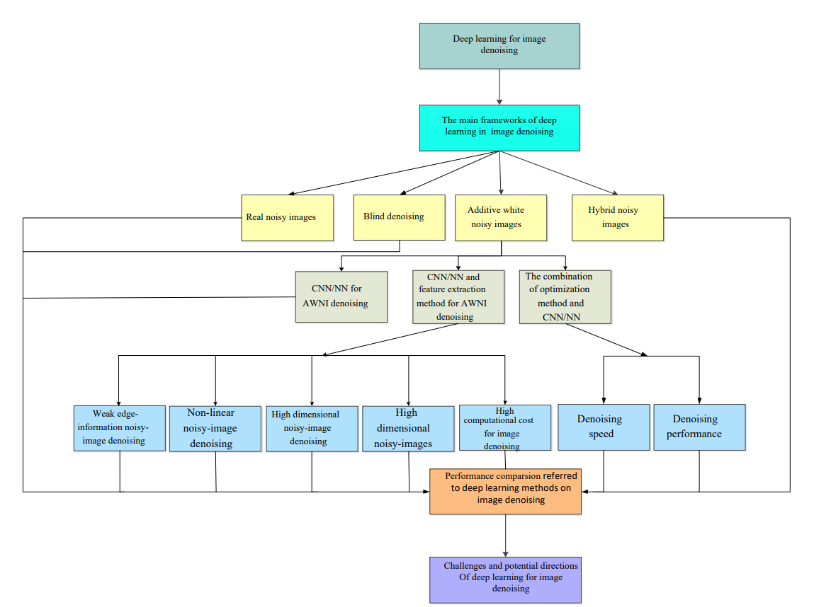

# 深度学习在图像去噪中的应用综述

来源：{cite:p}`DeepLearningImageDenoisingOverview`

不同类型的深度学习方法在处理图像去噪方面存在着实质性的差异：

- 基于深度学习的判别学习（discriminative learning）可以很好地解决高斯噪声问题。
- 基于深度学习的优化模型（optimization models）可以有效地估计真实噪声。

去噪声 CNN：

- 加性白噪声（additive white noisy）图像 CNN；
- 真实噪声图像的深度 CNN；
- 用于盲去噪（blind denoising）的深度 CNN；
- 用于混合噪声图像的深度 CNN（表示噪声、模糊和低分辨率图像的组合）。

## 引言

捕获的图像是来自潜在观测的退化图像（degraded image），其中退化处理受到光照和噪声破坏等因素的影响。具体来说，噪声是由未知的潜在观测（unknown latent observation）在传输和压缩过程中产生的。利用图像去噪技术去除噪声，从给定的退化图像中恢复潜在的观测是必要的。

```{note}
图像在形成、记录、处理和传输过程中，由于成像系统、记录设备、传输介质和处理方法的不完善，导致图像质量的下降，这种现象叫做 **图像退化**。
```

通过模型处理多个低级任务：去噪 CNN（DnCNN {cite:p}`DnCNN`）、batch normalization（BN {cite:p}`BN`）、线性整流函数（ReLU）和深度残差学习。

考虑到去噪性能和速度之间的权衡，颜色非局部网络（color non-local network，CNLNet {cite:p}`CNLNet`）结合了非局部自相似度（non-local self-similarity，简称 NLSS）有效去除彩色图像噪声。

在盲去噪方面，快速灵活的 FFDNet（{cite:p}`FFDNet`）提出了不同的噪声水平，并将有噪声的图像贴片作为去噪网络的输入，以提高去噪速度并处理盲去噪。对于处理非成对噪声图像（unpaired noisy images），生成对抗网络（GAN）CNN 盲降噪器（GCBD {cite:p}`GCBD`）首先生成 ground truth，然后将获得的 ground truth 输入 GAN 进行降噪训练，解决了这一问题。或者，卷积盲去噪网络（CBDNet {cite:p}`CBDNet`）通过两个子网络从给定的真实噪声图像中去除噪声，一个负责估计真实噪声图像的噪声，另一个负责获得潜在的干净图像。对于更复杂的损坏图像，开发了一种深度即插即用超分辨率（DPSR {cite:p}`DPSR`）方法来估计模糊核（blur kernel）和噪声，并恢复高分辨率图像。

```{note}
DnCNN、FFDnet、CBDnet 是联系十分紧密的系列，是逐步泛化，逐步考虑增加噪声复杂的过程，DnCNN 主要针对高斯噪声进行去噪，强调残差学习和 BN 的作用，FFDnet 考虑将高斯噪声泛化为更加复杂的真实噪声，将噪声水平图作为网络输入的一部分，CBDnet 主要是针对 FFDnet 的噪声水平图部分入手，通过 5 层 FCN 来自适应的得到噪声水平图，实现一定程度上的盲去噪。
```

论文主要贡献：

- 概述了深度学习方法在图像去噪领域的作用。
- 概述了深度学习技术对不同类型噪声（即加性白噪声、盲噪声（指未知类型的噪声）、真实噪声和混合噪声）的解决方案，分析了这些方法在图像去噪中的动机和原理。最后，从定量和定性两方面对这些方法的去噪性能进行了评价。
- 概述了深度学习在图像去噪中的一些潜在挑战和发展方向。



## 图像去噪深度学习方法的基本框架

本节提供了深度学习的讨论，包括它背后的思想，主要的网络框架（技术），以及硬件和软件，这是本文所涵盖的用于图像去噪的深度学习技术的基础。

### 图像去噪的机器学习方法

机器学习方法包括有监督、半监督和无监督学习方法。监督学习方法使用给定的标签使获得的特征更接近目标，用于学习参数和训练去噪模型。例如，取给定的去噪模型 $y = x + \mu$，其中 $x$、$y$ 和 $\mu$ 分别代表给定的干净图像、噪声图像和标准差 $\sigma$ 的加性高斯噪声（additive Gaussian noise，简称 AWGN）。由上式和贝叶斯知识可知，去噪模型参数的学习依赖于 $\{x_k, y_k\}_{k=1}^N$，其中 $x_k$ 和 $y_k$ 分别表示第 $k$ 个干净图像和第 $k$ 个噪声图像。$N$ 是噪声图像的个数。这个处理可以表示为 $x_k = f(y_k, \theta, m)$，其中 $\theta$ 为参数，$m$ 为给定的噪声水平。

无监督学习方法使用给定的训练样本来寻找模式，而不是标签匹配，并完成特定的任务，如对真实的低分辨率图像进行分离（unpairing）。Cycle-in-Cycle GAN（CinCGAN {cite:p}`CinCGAN`）方法首先估计高分辨率图像作为标签，然后利用获得的标签和损失函数训练超分辨率模型。

半监督学习方法从给定的数据分布中建立模型来为未标记的样本进行标记。这种机制在小样本任务（如医疗诊断）中很受欢迎。半监督学习正弦图（sinogram）恢复网络（SLSR-Net {cite:p}`SLSR-Net`）可以通过监督网络从成对的正弦图中学习特征分布，然后通过无监督网络将获得的特征分布从未标记的  low-dose 正弦图转换为高保真（high-fidelity）正弦图。

## 图像去噪中的深度学习技术

### 加性白噪声图像去噪

由于真实噪声图像的不足，加性白噪声图像（additive white noisy images，简称 AWNIs {cite:p}`AWNIs`）被广泛用于训练去噪模型。AWNIs 包括 Gaussian, Poisson, Salt, Pepper 和 multiplicative 噪声图像。AWNI 去噪有几种深度学习技术，包括 CNN/NN；CNN/NN 与通用特征提取方法相结合；优化方法与 CNN/NN 相结合。

### 讨论

基于深度学习的图像去噪主要在改善去噪性能、提高去噪效率和完成复杂的去噪任务方面有效，但是仍然存在一些挑战。

1. 改善去噪性能的解决方案包括：
    - 扩大感受可以捕获更多上下文信息。空洞卷积不仅可以提高性能和效率，还能挖掘更多边缘信息
    - 使用先验知识有助于获得更准确的特征。通过设计损失函数实现
    - 结合全局和局部信息可以更好滤除噪声。残差和递归操作可以解决这个问题
    - 结合全局和局部信息可以更好滤除噪声。残差和递归操作可以解决这个问题
    - 信号处理方法可以用于抑制噪声。将信号处理方法融入CNN，如U-Net结合小波变换
    - 数据增强（如水平翻转、垂直翻转和色彩抖动等）可以增强模型表达能力。使用GAN构造虚拟噪声图像对于图像去噪也很有用
    - 迁移学习（transfer learning）、图（graph）方法和神经结构搜索（NAS）可以获得较好的去噪效果
    - 改进硬件或摄像机的机制有助于减小噪声的影响

2. 提高去噪效率的解决方案包括：
    - 压缩网络在提高去噪效率上取得了巨大成功
    - 减少网络的深度或宽度可以降低去噪的复杂性
    - 使用小卷积核和分组卷积可以减少参数数量，加快训练速度
    - 融合降维方法（如PCA）可以提高去噪效率

3. 解决复杂去噪任务的解决方案包括：
    - step-by-step的处理是一种常用的方法，如第一步恢复高分辨率图像，第二步滤除高分辨率图像的噪声。
    - 融入CNN的自监督学习是应对真实噪声和盲去噪的不错选择


存在的挑战：

- 更深的网络需要更多的内存资源
- 更深的网络对于真实噪声图像、不成对噪声图像和多重退化任务来说并不稳定
- 真实的噪声图像难以获取，导致训练样本不足
- 深度CNN难以解决无监督去噪任务
- 对于图像去噪效果，需要更准确的评价指标（PSNR过度平滑，SSIM取决于亮度、对比度和结构，它们无法准确评估图像的感知质量）
